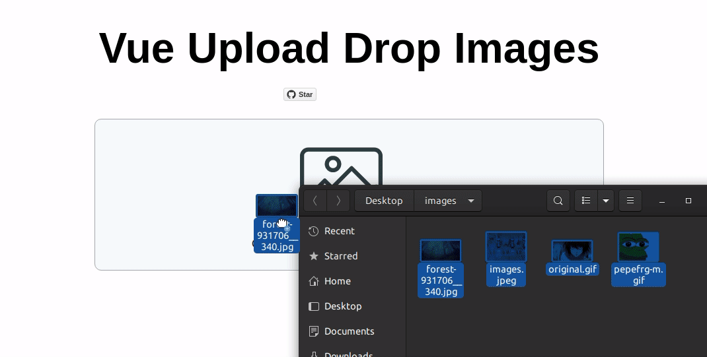

# Vue Images Upload Component
Vue component that provides drag and drop images upload with preview.

**⚠️ currently this components supports only vue2**



## Features

* Upload files by Drag & Drop
* Upload files by clicking on the upload icon
* Add images 
* Delete Images
* Append Images
* Remove all images

## Example

[DEMO](https://vueupload.yudax.dev)

## Install

1. install the package:
 
    ```bash
        npm i vue-upload-drop-images --save
    ```

2. import it in your project

   .vue file:
   ```javascript
        <script>
            import UploadImages from "vue-upload-drop-images"
            ...
            export default {
                    components: {
                        UploadImages,
                    },
            ...
        </script>
   ```
3. add component in template
   ```html
        <template>
        ...
            <UploadImages />
        ...
        </template>

   ```

## Events

### <b>@changed</b>
Fired when new images are added or deleted it always returns uploaded files

Template:

```html
        <UploadImages @changed="handleImages"/>
```    

Script:

```javascript
    ...
        methods:{
            handleImages(files){
                console.log(files)
                /*
                  [
                    {
                        "name": "Screenshot from 2021-02-23 12-36-33.png",
                        "size": 319775,
                        "type": "image/png",
                        "lastModified": 1614080193596
                        ...
                    },
                    ...
                    ]
                 */
            }
        }
    ...
```


## Props
### <b>max</b>
Type: `Number`

Required: `false`

default: `null`

```html
    <!-- the user can upload up to 5 images-->
    <UploadImages :max="5"/>
```

### <b>maxError</b>
Type: `String`

Required: `false`

default: `Maximum files is`

```html
    <!-- the error message that the user sees when the uploaded images greater that the max images required-->
    <UploadImages maxError="Max files exceed"/>
```

### <b>uploadMsg</b>
Type: `String`

Required: `false`

default: `Click to upload or drop your images here`

```html
    <!-- the message that the user see to upload the images -->
    <UploadImages uploadMsg="upload product images"/>
```

### <b>fileError</b>
Type: `String`

Required: `false`

default: `Unsupported file type`

```html
    <!-- the message that the user see when the uploaded file is not an image -->
    <UploadImages fileError="images files only accepted"/>
```

### <b>clearAll</b>
Type: `String`

Required: `false`

default: `clear All`

```html
    <!-- the name of the remove all images button -->
    <UploadImages clearAll="remove all images" />
```
